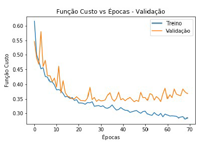

# diabetes_binary_classification
Project developed in the post graduate subject IA048-Machine Learning at FEEC,UNICAMP. Binary classification using a MLP network

## Dataset Description (first rows)

As shown in the table above, this dataset contains 8 attributes that corresponds to information of women's from idigenous origins that lives in the Phoenix, Arizona.
The diabetesPedigreeFunction index gives the chance of a person to have diabetes according to the family history, also, the last column [Outcome] tell us if a woman has diabetes Outcome = 1; or doesn't have diabetes Outcome = 0.

## Data PreProcessing
As suggested in MLP applications, the dataframe was firstly scaled using the MinMaxScaler from scikit-learn;
The data was also splitted according to the holdout cross-validation (80-20) and applying the stratifaction to make sure that both train/test dataset had the same proportion of classes.

## Searching the best number of neurons in the hidden Layer
### Optmizer, activation function, loss and metrics of the network can be found in the source code
For this project, only one hidden layer was used, so the best number of neurons in this hidden layer were searched by comparing the accuracy of the model with the number of neurons varying from 1 to 5000 in a step of 20. The best number found was 2661. The figure below show us this analyses:

## Finding the best number of epochs to train our model
### using the best number of neurons in the hidden layer in the previous step, and applying the model in both test and train set.

As can be seen in the image from epoch 46 and beyond, our model starts to overfit in the validation set so our final model was training using only 46 epochs.

## Final Results
The confusion matrix can be seen in the last part of the source code, but our model only resulted in 6 false negatives.